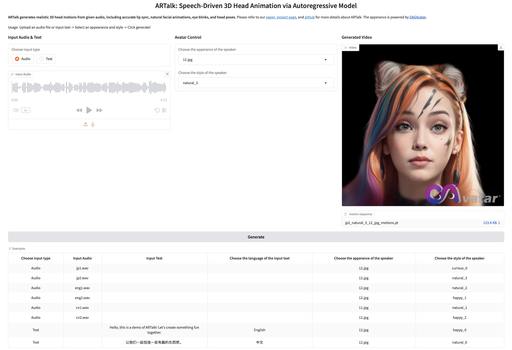

<h1 align="center"><b></b></h1>
<h1 align="center"><b>ARTalk: Speech-Driven 3D Head Animation via Autoregressive Model</b></h1>
<h3 align="center">
    <a href='https://arxiv.org/abs/2502.20323'></a> &nbsp; 
    <a href='https://xg-chu.site/project_artalk/'></a> &nbsp; 
    <!-- <a href='https://www.youtube.com/watch?v=9244ZgOl4Xk'></a> &nbsp;  -->
    <a href='https://github.com/xg-chu/GAGAvatar/'></a> &nbsp; 
</h3>

<h5 align="center">
    <a href="https://xg-chu.site">Xuangeng Chu</a><sup>1</sup>&emsp;
    <a href="https://naba89.github.io">Nabarun Goswami</a><sup>1</sup>,</span>&emsp;
    <a href="https://cuiziteng.github.io">Ziteng Cui</a><sup>1</sup>,</span>&emsp;
    <a href="https://openreview.net/profile?id=~Hanqin_Wang1">Hanqin Wang</a><sup>1</sup>,</span>&emsp;
    <a href="https://www.mi.t.u-tokyo.ac.jp/harada/">Tatsuya Harada</a><sup>1,2</sup>
    <br>
    <sup>1</sup>The University of Tokyo,
    <sup>2</sup>RIKEN AIP
</h5>

<div align="center"> 
    <!-- <div align="center"> 
        <b></b>
    </div> -->
    <b>
        ARTalk generates realistic 3D head motions (lip sync, blinking, expressions, head poses) from audio.
    </b>
    <br>
        🔥 More results can be found in our <a href="https://xg-chu.site/project_artalk/">Project Page</a>. 🔥
</div>

<!-- ## TO DO
We are now preparing the <b>pre-trained model and quick start materials</b> and will release it within a week. -->

## Installation
### Clone the project
```
git clone --recurse-submodules git@github.com:xg-chu/ARTalk.git
cd ARTalk
```

### Build environment

```
conda env create -f environment.yml
conda activate ARTalk
```

Install the GAGAvatar module (if you want to use realistic avatars). If it is not installed, set `load_gaga` to `False` when initializing `ARTAvatarInferEngine`.

```
git clone --recurse-submodules git@github.com:xg-chu/diff-gaussian-rasterization.git
pip install ./diff-gaussian-rasterization
rm -rf ./diff-gaussian-rasterization
```

### Prepare resources
Prepare resources with:
```
bash ./build_resources.sh
```

## Quick Start Guide
### Using <a href="https://github.com/gradio-app/gradio">Gradio</a> Interface

We provide a simple Gradio demo to demonstrate ARTalk's capabilities.

You can generate videos by **uploading audio**, **recording audio**, or **entering text**:
<h1 align="left"><b></b></h1>
```
python inference.py --run_app
```

### Command Line Usage

ARTalk can be used via command line:
```
python inference.py -a your_audio_path --shape_id your_apperance --style_id your_style_motion --clip_length 750
```
`--shape_id` can be specified with `mesh` or tracked real avatars stored in `tracked.pt`.

`--style_id` can be specified with the name of `*.pt` stored in `assets/style_motion`.

`--clip_length` sets the maximum duration of the rendered video and can be adjusted as needed. Longer videos may take more time to render.

<details>
<summary><span>Track new real head avatar and new style motion</span></summary>

The file `tracked.pt` is generated using <a href="https://github.com/xg-chu/GAGAvatar/blob/main/inference.py">`GAGAvatar/inference.py`</a>. Here I've included several examples of tracked avatars for quick testing.

The style motion is tracked with EMICA module in <a href="https://github.com/xg-chu/GAGAvatar_track">`GAGAvatar_track` </a>. Each contains `50*106` dimensional data. `50` is 2 seconds consecutive frames, `106` is `100` expression code and `6` pose code (base+jaw). Here I've included several examples of tracked style motion.
</details>

## Training

This version modifies the VQVAE part compared to the paper version.

The training code and the paper version code are still in preparation and are expected to be released later.


## Acknowledgements

We thank <a href="https://www.linkedin.com/in/lars-traaholt-vågnes-432725130/">Lars Traaholt Vågnes</a> and <a href="https://emmanueliarussi.github.io">Emmanuel Iarussi</a> from <a href="https://www.simli.com">Simli</a> for the insightful discussions! 🤗

The ARTalk logo was designed by Caihong Ning.

Some part of our work is built based on FLAME.
We also thank the following projects for sharing their great work.
- **GAGAvatar**: https://github.com/xg-chu/GAGAvatar
- **GPAvatar**: https://github.com/xg-chu/GPAvatar
- **FLAME**: https://flame.is.tue.mpg.de
- **EMICA**: https://github.com/radekd91/inferno


## Citation
If you find our work useful in your research, please consider citing:
```bibtex
@misc{
    chu2025artalk,
    title={ARTalk: Speech-Driven 3D Head Animation via Autoregressive Model}, 
    author={Xuangeng Chu and Nabarun Goswami and Ziteng Cui and Hanqin Wang and Tatsuya Harada},
    year={2025},
    eprint={2502.20323},
    archivePrefix={arXiv},
    primaryClass={cs.CV},
    url={https://arxiv.org/abs/2502.20323}, 
}
```